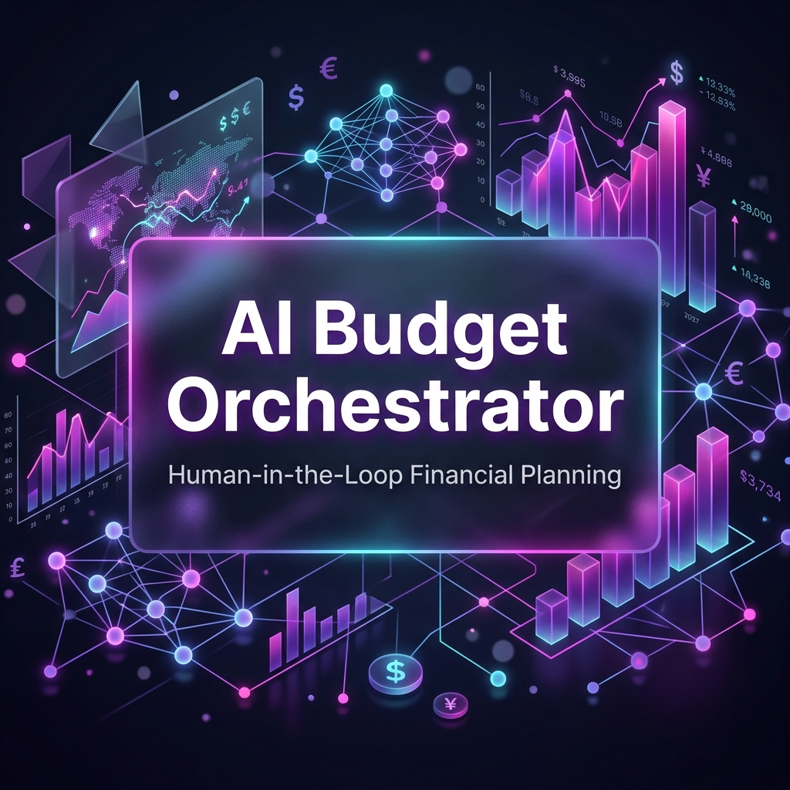
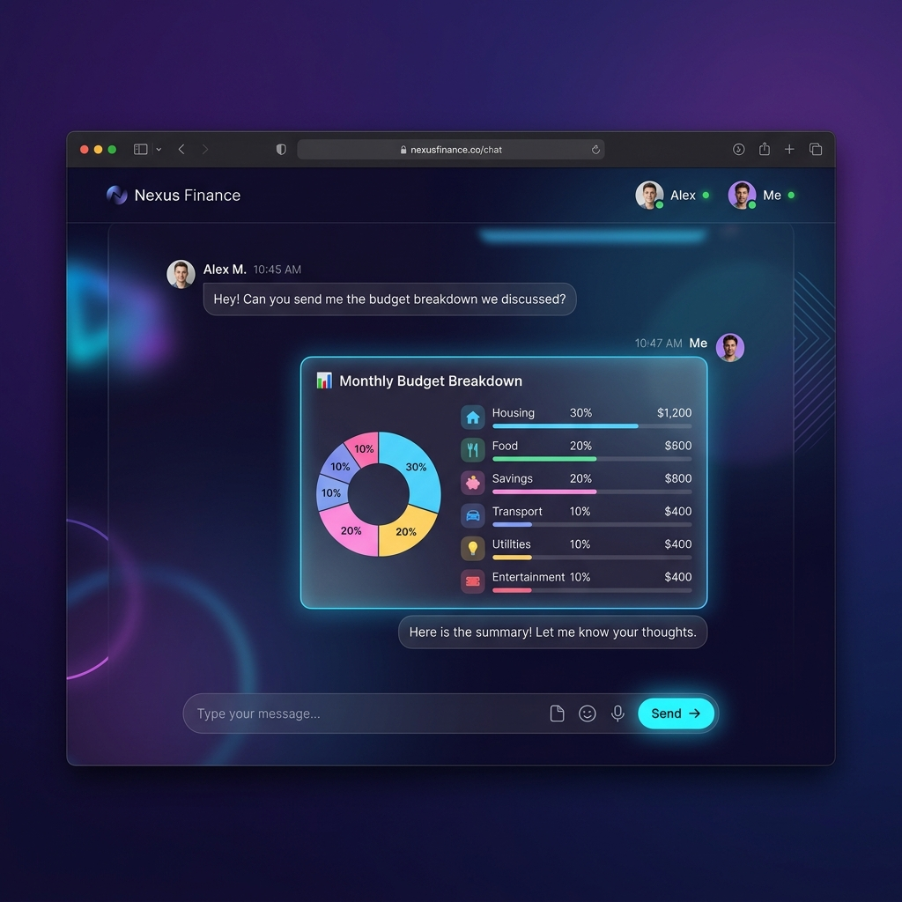

# AI Budget Orchestrator



This project is an advanced, AI-powered financial planning tool built with the **Google Agent Development Kit (ADK)**. 

It leverages the Gemini models (specifically `gemini-3.1-flash-lite`) to dynamically evaluate a user's financial goals, calculate precise budgets, and actively request approval for strategic adjustments using ADK's Human-in-the-Loop workflows via LongRunningFunctionTools.

## Features


- **ADK Agent Architecture:** Utilizes ADK `Runner` and `SessionService` for fully stateful, context-aware interactions.
- **Glassmorphism UI:** A stunning, premium frontend interface that communicates with the API via Server-Sent Events (SSE).
- **Custom API Key Support:** Includes a UI modal allowing users to input their own Gemini API Key directly, allowing secure and independent evaluations.
- **Human in the Loop:** The agent computes a draft budget and explicitly requests user verification via structured Tool calling before finalizing the response.

## Architecture
- **Backend:** Python, FastAPI, Google GenAI SDK, Google Agent Development Kit (ADK).
- **Frontend:** Vanilla HTML/CSS/JS with Server-Sent Event (SSE) buffer chunk parsing.
- **Security:** Secret isolation using `.env` files and `python-dotenv`, session isolation via ADK context memory.

## Project Structure
```text
AI-Budget-Planner-Expense-Analyst/
├── app/                  # ADK Backend
│   ├── agent.py          # Core AI agent & tools logic
│   └── fast_api_app.py   # FastAPI server and streaming endpoints
├── static/               # Frontend UI
│   ├── index.html        # Main interface & settings modal
│   ├── styles.css        # Glassmorphism styling
│   └── app.js            # Client-side logic & SSE parsing
├── tests/                # Test suite
├── .env                  # Environment variables
├── pyproject.toml        # Python project configuration
└── README.md             # Project documentation
```

## Setup Instructions

1. Ensure you have Python 3.10+ installed. This project uses `uv` for dependency management.
2. Install the required dependencies:
   ```bash
   uv sync
   ```
3. Initialize the environment variables:
   Create a `.env` file in the root directory (or use the existing one) and add your default Gemini API key:
   ```env
   GEMINI_API_KEY=your_default_api_key_here
   ```

## Running the Agent

### Start the Server
Start the Uvicorn web server to initialize the FastAPI backend and serve the static frontend files:
```bash
uv run uvicorn app.fast_api_app:app --host 0.0.0.0 --port 8000
```

### Access the Web App
1. Open your browser and navigate to: `http://localhost:8000`
2. **Setup API Key:** Click the gear/settings icon in the top right corner of the header. Enter your personal Gemini API Key and save it (it is securely stored in your browser's LocalStorage).
3. **Chat:** Type a prompt, for example: *"I need a budget to save for a house"*.
4. The AI will stream back a highly sophisticated financial strategy, complete with percentages and automated savings recommendations.

## Customization
The agent's prompts and behaviors are configured in `app/agent.py` using `Agent` and `LongRunningFunctionTool` definitions. You can modify these to introduce new financial calculation tools, adjust the model version, or alter its core personality.
